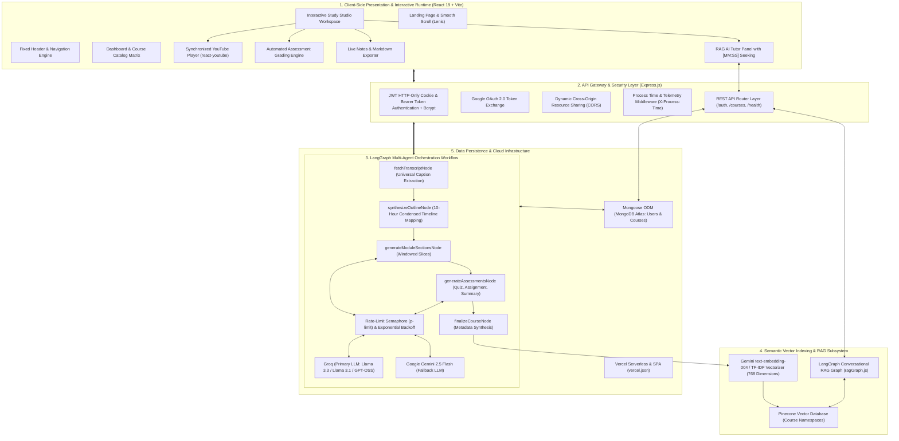
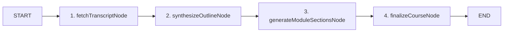
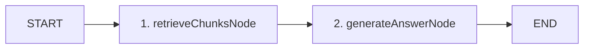

<p align="center">
  
</p>

<h1 align="center">Adhyaya AI</h1>

<p align="center">
  <strong>Agentic AI Learning Operating System</strong><br/>
  Automated Transformation of Long-Form Video Feeds and Playlists into Interactive Multi-Agent Curricula with LangGraph StateGraphs, Pinecone Vector RAG Tutoring, and Automated Assessment Engines.
</p>

<p align="center">
  
  
  
  
  
  
  
  
  
  
  
</p>

---

## Table of Contents

- [Overview](#overview)
- [Key Capabilities](#key-capabilities)
- [System Architecture](#system-architecture)
- [Multi-Agent Orchestration & Workflow](#multi-agent-orchestration--workflow)
  - [1. Curriculum Generation StateGraph](#1-curriculum-generation-stategraph)
  - [2. Context-Grounded RAG Tutor StateGraph](#2-context-grounded-rag-tutor-stategraph)
  - [3. LLM Failover & Concurrency Engine](#3-llm-failover--concurrency-engine)
- [Tech Stack](#tech-stack)
- [Project Directory Structure](#project-directory-structure)
- [Data Models & Vector Storage](#data-models--vector-storage)
  - [User Model](#user-model)
  - [Course Model](#course-model)
  - [Pinecone Vector Store (RAG Embeddings)](#pinecone-vector-store-rag-embeddings)
- [API Reference](#api-reference)
  - [System & Health Endpoints](#system--health-endpoints)
  - [Authentication Endpoints](#authentication-endpoints)
  - [Course & Learning Endpoints](#course--learning-endpoints)
- [Environment Configuration](#environment-configuration)
  - [Backend Environment Variables](#backend-environment-variables)
  - [Frontend Environment Variables](#frontend-environment-variables)
- [Installation & Local Development](#installation--local-development)
  - [Prerequisites](#prerequisites)
  - [Backend Installation](#backend-installation)
  - [Frontend Installation](#frontend-installation)
  - [Running the Development Environment](#running-the-development-environment)
- [Deployment Guide](#deployment-guide)
  - [Vercel Deployment (Frontend)](#vercel-deployment-frontend)
  - [Vercel Deployment (Backend)](#vercel-deployment-backend)
- [Troubleshooting](#troubleshooting)
- [License](#license)

---

## Overview

Adhyaya AI is a full-stack, agentic educational operating system designed to eliminate the passive inefficiencies of video-based learning. While video tutorials and long-form lecture masterclasses contain immense knowledge, learners frequently experience low retention due to the lack of interactive structure, missing assessments, and the inability to quickly query specific sections of long videos.

Adhyaya AI solves this by transforming any single YouTube lecture, long-form masterclass (supporting 10+ hours), or entire YouTube playlist into an interactive, multi-module course track.

Using a coordinated multi-agent workflow powered by LangGraph, Adhyaya AI ingests raw video transcripts, extracts prerequisite milestones, structures chronological lesson modules, synthesizes multi-choice quizzes with automated grading, provisions hands-on engineering assignments, and indexes semantic vector embeddings in Pinecone. Learners interact with an embedded Retrieval-Augmented Generation (RAG) AI Tutor that directly cites and jumps to exact `[MM:SS]` video timestamps.

---

## Key Capabilities

- **10+ Hour Video Map-Reduce Processing**: Incorporates adaptive timeline sampling (60s, 120s, and 180s intervals) and slice-based prompt mapping to parse massive lecture videos without exceeding token window limits.
- **YouTube Video & Playlist Ingestion**: Processes single video URLs or full YouTube playlists. Employs a multi-strategy caption ingestion pipeline that leverages YouTube transcript scrapers and direct timedtext XML parsing.
- **Multi-Agent Curriculum Generation**: Coordinated LangGraph StateGraph executes specialized agents to generate titles, structured lessons, objective quizzes, practical assignments, and module executive summaries.
- **Context-Grounded RAG AI Tutor**: Embedded conversational assistant that retrieves course transcript chunks via Pinecone cosine similarity vectors and generates answers with clickable `[MM:SS]` timestamp citations that seek the video player to exact moments.
- **Pinecone Vector Database Architecture**: Namespace-isolated vector indexes per course with 768-dimensional Gemini `text-embedding-004` (and fallback TF-IDF vectorizer) for sub-second semantic retrieval.
- **Synchronized Video Player Workspace**: Custom responsive player integrated with chapter markers, playback controls, and automatic lesson synchronization.
- **Interactive Quiz Engine & Automatic Scoring**: Multi-choice assessments with instant validation, answer explanations, score persistence, and completion status updates.
- **Live Scratchpad & Notes System**: Built-in notepad allowing learners to record timestamped notes while studying.
- **Markdown Syllabus & Notes Export**: Generates downloadable Markdown files containing the full course syllabus, lesson notes, and module summaries.
- **Cryptographic Course Completion Certificates**: Automatically issues verifiable certificates with unique SHA-256 hash IDs upon 100% completion of all module lessons.
- **Dual Authentication**: Full support for both local email/password authentication (with bcrypt hashing and JWT HTTP-only cookies / Bearer headers) and Google OAuth 2.0.
- **Zero-Flicker Custom UI Engine**: Modern interface with smooth scrolling (Lenis), Framer Motion transitions, responsive layouts, global toast notifications, and customizable settings.

---

## System Architecture



---

## Multi-Agent Orchestration & Workflow

### 1. Curriculum Generation StateGraph

The curriculum generation pipeline is managed by a compiled LangGraph `StateGraph` defined in `backend/src/agents/curriculumGraph.js`. The state flows through sequential nodes:



1. **fetchTranscriptNode**:
   - Accepts YouTube video or playlist URL.
   - Executes multi-tier caption extraction (`youtube-transcript` primary, auto-caption fallback, and direct timedtext XML parser).
   - Generates a condensed chronological timeline with adaptive interval downsampling (60s to 180s checkpoints) to condense 10+ hour video transcripts into structured token representations.
2. **synthesizeOutlineNode**:
   - Calculates target module depth based on video duration:
     - Duration > 8 hours: 12 modules
     - Duration > 4 hours: 8 modules
     - Duration > 2 hours: 6 modules
     - Duration > 1 hour: 4 modules
     - Duration < 1 hour: 3 modules
   - Prompts the LLM with the timeline summary to synthesize chronological macro-module boundaries with precise start and end timestamps.
3. **generateModuleSectionsNode**:
   - Iterates through each module window and slices the transcript.
   - Divides each module into sub-lesson chunks and prompts the LLM to generate descriptive lesson titles.
   - Executes parallel agent promises for each module:
     - `generateQuiz`: Synthesizes multi-choice conceptual questions with option arrays, correct indices, and detailed explanations.
     - `generateAssignment`: Synthesizes practical lab tasks, challenge scenarios, and step-by-step guidance.
     - `generateSummary`: Synthesizes executive summaries, key bulleted takeaways, and external resource recommendations.
4. **finalizeCourseNode**:
   - Synthesizes comprehensive course metadata, title, and description.
   - Compiles the final course schema and marks progress at 100%.
   - Triggers asynchronous Pinecone vector embedding for all course text chunks.

### 2. Context-Grounded RAG Tutor StateGraph

The course chat assistant is powered by a LangGraph RAG pipeline defined in `backend/src/agents/ragGraph.js`:



1. **retrieveChunksNode**:
   - Takes the learner's query and course ID.
   - Computes query vector embedding via Gemini `text-embedding-004` (or fallback TF-IDF vectorizer).
   - Queries Pinecone Vector Database scoped to the course namespace (`courseId`), filtering with a relevance score threshold (0.10) and selecting top-k (8) matching chunks.
2. **generateAnswerNode**:
   - Formats the retrieved chunks with metadata headers (Module name, Section type, and timestamp).
   - Incorporates the last 6 conversation turns for multi-turn dialogue memory.
   - Prompts the LLM with instructions to answer strictly from the retrieved context and format any video timestamp references explicitly as `[MM:SS]` (or `[HH:MM:SS]`).
   - The frontend parses timestamp brackets and renders them as clickable links that jump the YouTube player to the exact video offset.

### 3. LLM Failover & Concurrency Engine

The LLM abstraction in `backend/src/services/llmService.js` provides enterprise-level reliability:

- **Concurrency Limiting**: Uses `p-limit` set to a concurrency limit of 3 to avoid exceeding provider rate limits.
- **Multi-Model Fallback Hierarchy**: Primary requests attempt fast Groq models (`llama-3.3-70b-versatile`, `llama-3.1-8b-instant`, `openai/gpt-oss-120b`, `qwen/qwen3.6-27b`).
- **Dynamic Retry-After Parsing**: Inspects `429 Too Many Requests` response headers and error messages (`try again in Xs`), applying precise exponential backoff.
- **Failover to Google Gemini**: Automatically routes generation to Google Gemini (`gemini-2.5-flash`, `gemini-1.5-flash`, `gemini-2.0-flash`) if Groq rate limits are reached or models are unavailable.
- **Resilient JSON Parser**: Employs regex extraction and quote repairing to parse JSON output from LLM responses even in the presence of conversational wrappers or markdown formatting.

---

## Tech Stack

| Domain | Technology | Description |
| :--- | :--- | :--- |
| **Frontend Framework** | React 19 | Modern React architecture with hooks, Suspense, and lazy loading |
| **Build Tooling** | Vite 8 | Ultra-fast build tool and local development server |
| **Routing** | React Router v7 | Client-side routing with protected route middleware |
| **Styling** | Tailwind CSS v4 & Vanilla CSS | Responsive design tokens, custom scrollbars, and dark mode |
| **UI & Animations** | Framer Motion & Lenis | Smooth scrolling and interactive UI transitions |
| **Media Player** | react-youtube | YouTube IFrame Player API wrapper with seeking controls |
| **Icons** | Lucide React & React Icons | Comprehensive SVG iconography |
| **HTTP Client** | Axios | Configured with token interceptors and centralized toast error handling |
| **Backend Runtime** | Node.js 20+ (ES Modules) | High-performance asynchronous JavaScript runtime |
| **API Framework** | Express.js 4 | RESTful API server with route modularization |
| **Agent Orchestration** | LangGraph & LangChain Core | StateGraph workflow for multi-agent curriculum and RAG pipelines |
| **Primary LLM Engine** | Groq SDK | High-throughput inference for Llama 3.3 and open models |
| **Secondary LLM Engine** | Google Generative AI | Gemini 2.5 Flash fallback and text-embedding-004 embeddings |
| **Vector Database** | Pinecone (`@pinecone-database/pinecone`) | 768-dimensional serverless vector index with per-course namespaces |
| **Document Database** | MongoDB Atlas & Mongoose 8 | Document database for users, course curricula, progress, and quizzes |
| **Authentication** | JWT & Bcrypt.js | Stateless JSON Web Tokens, HTTP-only cookies, Bearer headers, and bcrypt |
| **OAuth Integration** | Google OAuth 2.0 | Google Identity Services token exchange |
| **Caption Extraction** | youtube-transcript & Googleapis | Multi-strategy transcript retrieval and timedtext XML parsing |
| **Deployment** | Vercel | Serverless Express backend and Single Page Application frontend |

---

## Project Directory Structure

```text
Adhyaya AI/
├── README.md                          # Root Project Documentation
├── architecture.png                   # System Architecture Diagram Asset
├── thumbnail.png                      # Project Preview Thumbnail Asset
├── backend/                           # Backend Express Application
│   ├── README.md                      # Backend Comprehensive Technical Documentation
│   ├── package.json                   # Backend Dependencies and Scripts
│   ├── server.js                      # Express App Initialization & CORS Config
│   ├── vercel.json                    # Backend Vercel Serverless Routing Config
│   ├── Procfile                       # Deployment Process Configuration
│   ├── .env.example                   # Backend Environment Template
│   └── src/
│       ├── config/
│       │   ├── db.js                  # MongoDB Connection & Status Tracker
│       │   └── env.js                 # Environment Variable Loader & Validation
│       ├── middleware/
│       │   ├── auth.js                # JWT Authentication & Cookie Middleware
│       │   └── errorHandler.js        # Global Error Normalization Middleware
│       ├── models/
│       │   ├── User.js                # User Schema & Password Hashing Methods
│       │   └── Course.js              # Course, Module & Section Nested Schemas
│       ├── prompts/
│       │   ├── curriculumPrompts.js   # Prompts for Outline, Quizzes & Summaries
│       │   └── ragPrompts.js          # Prompts for RAG Grounded Tutoring
│       ├── agents/
│       │   ├── curriculumGraph.js     # LangGraph Course Synthesis StateGraph
│       │   ├── curriculumAgent.js     # Curriculum Entry Agent Invoker
│       │   ├── ragGraph.js            # LangGraph Conversational RAG StateGraph
│       │   ├── chatAgent.js           # RAG Chat Handler Entry Point
│       │   ├── quizAgent.js           # Assessment Quiz Synthesis Agent
│       │   ├── assignmentAgent.js     # Lab & Practical Assignment Agent
│       │   └── summaryAgent.js        # Module Summary & Key Takeaways Agent
│       ├── services/
│       │   ├── llmService.js          # Groq & Gemini Client with Concurrency Limiter
│       │   ├── langchainService.js    # LangChain Chat Model Wrapper & Invoker
│       │   ├── embeddingService.js    # Pinecone Vector DB Integration, Embeddings & Cosine Search
│       │   ├── youtubeService.js      # Multi-Strategy Transcript & Playlist Parser
│       │   └── markdownService.js     # Markdown Course Syllabus Exporter
│       ├── controllers/
│       │   ├── authController.js      # Auth, Profile, Settings & Google OAuth
│       │   └── courseController.js    # Course CRUD, RAG Chat, Quizzes, Certificates
│       └── routes/
│           ├── authRoutes.js          # Authentication API Routes
│           ├── courseRoutes.js        # Course & Learning API Routes
│           └── healthRoutes.js        # Health Check & Telemetry Stats Routes
└── frontend/                          # Frontend React SPA Application
    ├── README.md                      # Frontend Architecture & Component Documentation
    ├── package.json                   # Frontend Dependencies and Scripts
    ├── vite.config.js                 # Vite Configuration & React Plugin
    ├── tailwind.config.js             # Tailwind CSS Configuration
    ├── index.html                     # HTML5 Entry Point
    ├── vercel.json                    # Frontend Single Page App Routing Config
    ├── .env.example                   # Frontend Environment Template
    └── src/
        ├── main.jsx                   # React Root Render & Google OAuth Provider
        ├── App.jsx                    # Route Hierarchy & Suspense Lazy Boundaries
        ├── index.css                  # Global Styles, Design Tokens & Scrollbars
        ├── context/
        │   ├── AuthContext.jsx        # Global Auth State, Login, Register & Session
        │   └── ToastContext.jsx       # Global Toast Notification Provider & Dispatcher
        ├── api/
        │   └── axios.js               # Axios Instance with Base URL, Bearer Tokens & Error Handler
        ├── hooks/
        │   └── useCourseProgress.js   # Course Progress Computation Hook
        ├── pages/
        │   ├── Home.jsx               # Landing Page with Hero & Feature Grid
        │   ├── Login.jsx              # User Login Interface
        │   ├── Register.jsx           # User Registration Interface
        │   ├── Dashboard.jsx          # User Dashboard & Course Overview Matrix
        │   ├── Courses.jsx            # My Courses List & Filter Matrix
        │   ├── Profile.jsx            # User Profile Details & Statistics
        │   └── Settings.jsx           # Application Preferences & Appearance
        ├── components/
        │   ├── ProtectedRoute.jsx     # Auth Guard for Protected Routes
        │   ├── RouteLoader.jsx        # Top Loading Bar for Navigation
        │   ├── Loader.jsx             # Animated Loading Spinner
        │   ├── SmoothScroll.jsx       # Lenis Smooth Scrolling Wrapper
        │   ├── NotFound.jsx           # 404 Error Page Component
        │   ├── Hero/                  # Landing Page Hero & Feature Sections
        │   │   ├── Navbar.jsx         # Landing Page Navigation Bar
        │   │   ├── Hero.jsx           # Hero Header with Demo Video Callout
        │   │   ├── AIAgents.jsx       # Interactive Multi-Agent Showcase
        │   │   ├── HowItWorks.jsx     # 4-Step Ingestion & Graph Workflow
        │   │   ├── EverythingYouNeed.jsx # Complete Feature Breakdown Grid
        │   │   ├── LearnBeyondWatching.jsx # Value Proposition Comparison
        │   │   ├── CTA.jsx            # Conversion Call to Action
        │   │   └── Footer.jsx         # Footer & Social Links
        │   ├── Dashboard/             # Dashboard Widgets & Analytics Components
        │   │   ├── Navbar.jsx         # Authenticated Application Navbar
        │   │   ├── Avatar.jsx         # Dynamic User Avatar Generator
        │   │   └── RecentCourseCard.jsx # Quick Resume Course Card
        │   └── Courses/
        │       ├── CourseCard.jsx     # Course Grid Display Card
        │       ├── CourseOverview.jsx # Course Syllabus & Module Preview Page
        │       ├── CourseDetail.jsx   # Interactive Study Studio Workspace
        │       ├── CreateCourseModal.jsx # Video / Playlist URL Input Modal
        │       ├── CustomYoutubePlayer.jsx # Synchronized YouTube Player
        │       ├── ChatPanel.jsx      # Embedded RAG AI Tutor Chat Interface
        │       └── CertificateModal.jsx # Verifiable Certificate Modal
        └── assets/
            └── logo.png               # Adhyaya AI Brand Logo
```

---

## Data Models & Vector Storage

### User Model

Defined in `backend/src/models/User.js`:

```javascript
{
  name: { type: String, default: "Adhyaya Scholar" },
  email: { type: String, required: true, unique: true, lowercase: true, index: true },
  password: { type: String, default: null }, // Nullable for Google OAuth users
  provider: { type: String, enum: ["local", "google"], default: "local" },
  settings: {
    darkMode: { type: Boolean, default: true },
    themeColor: { type: String, default: "amber" },
    fontSize: { type: String, default: "medium" },
    layoutMode: { type: String, default: "grid" }
  },
  createdAt: Date,
  updatedAt: Date
}
```

### Course Model

Defined in `backend/src/models/Course.js`:

```javascript
// Section Subdocument
{
  type: { type: String, enum: ["video", "quiz", "assignment", "summary"], default: "video" },
  title: { type: String, required: true },
  startTime: { type: Number, default: 0 },
  endTime: { type: Number, default: 0 },
  content: mongoose.Schema.Types.Mixed, // Text string, quiz object, assignment object, or summary object
  completed: { type: Boolean, default: false },
  quizScore: { type: Number, default: null },
  quizAnswers: mongoose.Schema.Types.Mixed,
  notes: { type: String, default: "" },
  completedAt: { type: Date, default: null }
}

// Module Subdocument
{
  title: { type: String, required: true },
  startTime: { type: Number, default: 0 },
  endTime: { type: Number, default: 0 },
  videoUrl: { type: String, default: "" },
  sections: [sectionSchema]
}

// Course Document
{
  title: { type: String, required: true },
  description: { type: String, default: "" },
  imageUrl: { type: String, default: null },
  videoUrl: { type: String, required: true },
  isPlaylist: { type: Boolean, default: false },
  status: { type: String, enum: ["generating", "completed", "failed"], default: "generating" },
  progress: { type: Number, default: 0, min: 0, max: 100 },
  progressStep: { type: String, default: "Initializing..." },
  errorMessage: { type: String, default: null },
  userId: { type: mongoose.Schema.Types.ObjectId, ref: "User", required: true, index: true },
  modules: [moduleSchema],
  createdAt: Date,
  updatedAt: Date
}
```

### Pinecone Vector Store (RAG Embeddings)

Vector search embeddings are indexed directly in Pinecone via `backend/src/services/embeddingService.js`:

- **Index Name**: `adhyaya-ai` (configured via `PINECONE_INDEX`)
- **Dimensions**: `768` (compatible with Gemini `text-embedding-004` and the fallback TF-IDF vectorizer)
- **Metric**: `cosine`
- **Namespace Isolation**: Each course creates a dedicated namespace `courseId` inside the index. When a course is deleted, its namespace vectors are purged via `index.namespace(courseId).deleteAll()`.
- **Vector Record Structure**:
  ```javascript
  {
    id: `${courseId}_m${mIdx}_s${sIdx}_c${cIdx}`,
    values: [/* 768 floating point numbers */],
    metadata: {
      courseId: "65d8a9b3f1...",
      moduleId: "0",
      sectionId: "1",
      text: "Transcript and summary content snippet...",
      courseTitle: "Deep Learning Specialization",
      moduleTitle: "Module 1: Neural Networks",
      sectionTitle: "Forward Propagation",
      sectionType: "video",
      startTime: 120,
      endTime: 360
    }
  }
  ```

---

## API Reference

### System & Health Endpoints

| Method | Endpoint | Auth | Description |
| :--- | :--- | :--- | :--- |
| `GET` | `/` | No | Service identity, version, environment, and feature flags |
| `GET` | `/health` | No | Basic health probe and database connection status |
| `GET` | `/health/stats` | No | System-wide statistics (users, courses, modules, completion rates) |

### Authentication Endpoints

| Method | Endpoint | Auth | Description |
| :--- | :--- | :--- | :--- |
| `POST` | `/auth/register` | No | Create a new user account with name, email, and password |
| `POST` | `/auth/login` | No | Authenticate user credentials and issue JWT token / cookie |
| `POST` | `/auth/google` | No | Exchange Google OAuth ID token for user session |
| `GET` | `/auth/me` | Yes | Retrieve profile and settings for currently authenticated user |
| `POST` | `/auth/logout` | No | Invalidate session and clear authentication state |
| `PUT` | `/auth/me` | Yes | Update profile name and user details |
| `PATCH` | `/auth/me/settings` | Yes | Update preferences (dark mode, theme color, font size, layout) |

### Course & Learning Endpoints

| Method | Endpoint | Auth | Description |
| :--- | :--- | :--- | :--- |
| `POST` | `/courses` | Yes | Submit a YouTube video/playlist URL to initiate background course generation |
| `POST` | `/courses/:id/retry` | Yes | Re-trigger generation for a failed or interrupted course |
| `GET` | `/courses` | Yes | Retrieve all courses belonging to the authenticated user |
| `GET` | `/courses/:id` | Yes | Retrieve complete course structure, modules, sections, and progress |
| `PATCH` | `/courses/:id` | Yes | Update course title, description, or metadata |
| `DELETE` | `/courses/:id` | Yes | Delete course and all corresponding Pinecone vector embeddings |
| `GET` | `/courses/:id/export` | Yes | Download comprehensive course syllabus and notes as a `.md` file |
| `GET` | `/courses/:id/certificate`| Yes | Verify 100% course completion and issue cryptographic certificate |
| `POST` | `/courses/:id/chat` | Yes | Query the RAG AI Tutor with student question and conversation history |
| `PATCH` | `/courses/sections/:sectionId/toggle` | Yes | Toggle completion status for a specific lesson section |
| `POST` | `/courses/sections/:sectionId/quiz-submit` | Yes | Submit quiz answers and score for automatic evaluation |

---

## Environment Configuration

### Backend Environment Variables

Create a `.env` file in the `backend/` directory based on the template:

```env
# Server Port & Environment
PORT=8000
NODE_ENV=development

# Frontend Client URL & Allowed Origins (comma-separated)
CLIENT_URL=http://localhost:5173
ALLOWED_ORIGINS=http://localhost:5173,http://localhost:3000

# MongoDB Connection String
MONGODB_URI=mongodb+srv://<username>:<password>@cluster0.xxxxx.mongodb.net/adhyaya_ai?retryWrites=true&w=majority

# JWT Authentication Secret & Algorithm
SECRET_KEY=your_jwt_secret_key_minimum_32_characters_long
ALGORITHM=HS256

# Google OAuth & Gemini AI Configuration
GOOGLE_CLIENT_ID=your_google_oauth_client_id.apps.googleusercontent.com
GOOGLE_API_KEY=your_google_gemini_api_key
GOOGLE_URL=https://www.googleapis.com/oauth2/v3/userinfo

# Groq High-Speed LLM Inference API Key
GROQ_API_KEY=gsk_your_groq_api_key_here

# YouTube Data API Key (Optional fallback for playlist metadata)
YOUTUBE_API_KEY=your_youtube_data_api_v3_key_here

# Pinecone Vector Database (768 dimensions, cosine metric)
PINECONE_API_KEY=your_pinecone_api_key_here
PINECONE_INDEX=adhyaya-ai
```

### Frontend Environment Variables

Create a `.env` file in the `frontend/` directory based on the template:

```env
# Backend API Base URL
VITE_API_URL=http://localhost:8000

# Google OAuth 2.0 Web Client ID
VITE_GOOGLE_CLIENT_ID=your_google_oauth_client_id.apps.googleusercontent.com

# YouTube Data API Key (Optional)
VITE_YOUTUBE_API_KEY=your_youtube_data_api_v3_key_here
```

---

## Installation & Local Development

### Prerequisites

Ensure the following tools are installed on your workstation:
- **Node.js**: Version 20.0.0 or higher
- **npm**: Version 10.0.0 or higher (or `pnpm` / `yarn`)
- **MongoDB**: A running local MongoDB instance or a MongoDB Atlas cluster URI
- **Pinecone Account**: Free tier Pinecone vector index (768 dimensions, cosine metric)
- **API Keys**: Active API keys from Groq Cloud and Google AI Studio

### Backend Installation

1. Navigate to the backend directory:
   ```bash
   cd backend
   ```
2. Install dependencies:
   ```bash
   npm install
   ```
3. Create your `.env` configuration:
   ```bash
   cp .env.example .env
   ```
   Edit `.env` with your MongoDB URI, JWT Secret, Pinecone API Key, and LLM API keys.

4. Start the backend development server (with auto-reloading):
   ```bash
   npm run dev
   ```
   The backend service will be available at `http://localhost:8000`. Verify status at `http://localhost:8000/health`.

### Frontend Installation

1. Open a new terminal and navigate to the frontend directory:
   ```bash
   cd frontend
   ```
2. Install dependencies:
   ```bash
   npm install
   ```
3. Create your `.env` configuration:
   ```bash
   cp .env.example .env
   ```
   Edit `.env` and verify `VITE_API_URL` points to `http://localhost:8000`.

4. Start the Vite development server:
   ```bash
   npm run dev
   ```
   The application will be accessible at `http://localhost:5173`.

### Running the Development Environment

Once both servers are running:
1. Open your browser and navigate to `http://localhost:5173`.
2. Register a new user account or sign in with Google OAuth.
3. Click "Create Course" on the Dashboard.
4. Paste any public YouTube tutorial URL (e.g. a Python, React, Machine Learning, or System Design masterclass).
5. Watch the LangGraph state orchestration build your interactive curriculum with structured lessons, quizzes, lab assignments, and vector chunks.

---

## Deployment Guide

Adhyaya AI is optimized for deployment on Vercel or any containerized cloud platform (such as Render, Railway, or AWS).

### Vercel Deployment (Frontend)

The frontend contains a `frontend/vercel.json` file configuring SPA fallback routing:

```json
{
  "rewrites": [
    {
      "source": "/(.*)",
      "destination": "/index.html"
    }
  ]
}
```

1. Deploy the `frontend` root directory to Vercel.
2. In the Vercel project settings, set the environment variables:
   - `VITE_API_URL`: Your deployed backend production URL (e.g., `https://your-backend.vercel.app`)
   - `VITE_GOOGLE_CLIENT_ID`: Your Google OAuth Client ID
   - `VITE_YOUTUBE_API_KEY`: Your YouTube API Key

### Vercel Deployment (Backend)

The backend contains a `backend/vercel.json` file configuring Express serverless routing:

```json
{
  "version": 2,
  "builds": [
    {
      "src": "server.js",
      "use": "@vercel/node"
    }
  ],
  "routes": [
    {
      "source": "/(.*)",
      "destination": "server.js"
    }
  ]
}
```

1. Deploy the `backend` root directory to Vercel.
2. In the Vercel project settings, configure all backend environment variables:
   - `NODE_ENV`: `production`
   - `CLIENT_URL`: Your deployed frontend production URL (e.g., `https://your-frontend.vercel.app`)
   - `ALLOWED_ORIGINS`: `https://your-frontend.vercel.app`
   - `MONGODB_URI`: Your MongoDB Atlas production connection string
   - `SECRET_KEY`: Production JWT secret key
   - `GROQ_API_KEY`: Groq API key
   - `GOOGLE_API_KEY`: Google Gemini API key
   - `GOOGLE_CLIENT_ID`: Google OAuth Client ID
   - `PINECONE_API_KEY`: Pinecone Vector DB API key
   - `PINECONE_INDEX`: `adhyaya-ai`

---

## Troubleshooting

### Connection Refused (`net::ERR_CONNECTION_REFUSED` / Network Error)
- **Symptom**: Frontend shows `Failed to load resource: net::ERR_CONNECTION_REFUSED` or `[Adhyaya Login Error] {message: 'Network Error'}` when logging in or making API requests.
- **Cause**: The backend server is not running on port `8000`, or `VITE_API_URL` is pointing to the wrong host.
- **Solution**:
  1. Ensure the backend server is running: `cd backend && npm run dev`.
  2. Verify that `http://localhost:8000/health` returns `{"status":"healthy","db_connected":true}`.
  3. Ensure `frontend/.env` contains `VITE_API_URL=http://localhost:8000`.

### YouTube Caption Extraction Issues
- **Symptom**: Course creation fails with error "Could not extract video content or transcripts".
- **Cause**: The submitted video does not have English captions, has disabling restrictions, or is private.
- **Solution**: Ensure the YouTube video has closed captions (CC) enabled. The ingestion engine automatically attempts auto-generated captions, but videos completely lacking transcripts cannot be structured into timeline-accurate curricula.

### Rate Limits with LLM Providers
- **Symptom**: Slow module generation or transient `429 Too Many Requests` notices.
- **Cause**: Reached tier limits on Groq free/developer tier.
- **Solution**: The platform includes built-in concurrency gating (`p-limit`), automatic exponential backoff retry parsing, and failover to Google Gemini (`gemini-2.5-flash`). Verify both `GROQ_API_KEY` and `GOOGLE_API_KEY` are provided in `.env`.

### Pinecone Vector Database Issues
- **Symptom**: RAG Chat returns fallback or empty responses.
- **Cause**: Missing `PINECONE_API_KEY` or index dimension mismatch.
- **Solution**: Create a Pinecone serverless index with name `adhyaya-ai`, metric `cosine`, and `768` dimensions. If `PINECONE_API_KEY` is omitted, the system falls back to in-memory TF-IDF vector ranking.

### MongoDB Connection Errors
- **Symptom**: Backend logs report database connection timeouts (`MongooseError`).
- **Cause**: IP Whitelist restrictions in MongoDB Atlas or invalid connection string credentials.
- **Solution**: In MongoDB Atlas, verify that your current IP address (or `0.0.0.0/0` for cloud serverless environments) is permitted under Network Access.

### Cross-Origin Resource Sharing (CORS) Errors
- **Symptom**: Browser console indicates CORS policy blocks requests between frontend and backend.
- **Cause**: `CLIENT_URL` or `ALLOWED_ORIGINS` in `backend/.env` does not match the frontend origin.
- **Solution**: Verify `CLIENT_URL` in `backend/.env` matches the exact URL and port of your frontend (e.g. `http://localhost:5173` or `https://your-frontend.vercel.app`).

---

## License

This project is licensed under the MIT License. You are free to modify, distribute, and integrate this software in your own applications.
