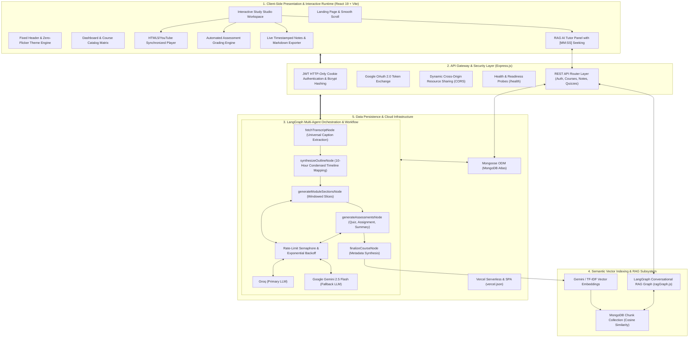

  

<h1 align="center">Adhyaya AI</h1>

  <strong>Agentic AI Learning Operating System</strong> 
  <em>Automated Transformation of 10+ Hour Video Feeds into Interactive Multi-Agent Curricula with LangGraph StateGraphs & Context-Grounded RAG Tutoring</em>

  
  
  
  
  
  
  
  

---

## Executive Summary

Adhyaya AI is a production-grade, agentic educational platform that resolves passive video learning inefficiencies. The system transforms unstructured YouTube lectures and playlists (supporting 10+ hour masterclasses) into structured, interactive course workspaces.

By coordinating a **LangGraph StateGraph** of specialized AI agents, Adhyaya AI ingests raw video transcripts, extracts prerequisite milestones, structures chronological lesson modules with 10-hour map-reduce token optimization, synthesizes interactive assessment quizzes with instant client-side grading, provisions hands-on engineering labs, and indexes semantic vector embeddings in MongoDB to power an embedded **Retrieval-Augmented Generation (RAG) AI Tutor** with clickable `[MM:SS]` video timestamp citations.

---

## System Architecture

---

## Deployment (Vercel)

- **Frontend**: Single Page Application with Vite (`frontend/vercel.json`)
- **Backend**: Express Serverless on Node.js 20+ (`backend/vercel.json`)
