<p align="center">
  
</p>

<h1 align="center">Adhyaya AI</h1>

<p align="center">
  <strong>Agentic AI Learning Operating System</strong><br/>
  <em>Automated Transformation of Unstructured Video Feeds into Interactive Multi-Agent Curricula with Context-Grounded RAG Tutoring</em>
</p>

<p align="center">
  
  
  
  
  
  
  
  
</p>

---

## Executive Summary

Adhyaya AI is a production-grade, agentic educational platform that resolves passive video learning inefficiencies. The system transforms unstructured YouTube lectures and playlists into structured, interactive course workspaces similar to Coursera or Udemy.

By coordinating a directed acyclic graph (DAG) of specialized AI agents, Adhyaya AI ingests raw video transcripts, extracts prerequisite milestones, structures chronological lesson modules, synthesizes interactive assessment quizzes with instant client-side grading, provisions hands-on engineering labs, and indexes semantic chunk embeddings in ChromaDB to power an embedded **Retrieval-Augmented Generation (RAG) AI Tutor** with clickable `[MM:SS]` video timestamp citations.

---

## System Architecture

```mermaid
flowchart TD
    subgraph ClientTier ["1. Client-Side Presentation & Interactive Runtime (React 19 + Vite)"]
        UI_Home["Landing Page & Lenis Inertial Scroll"]
        UI_Nav["Fixed Header & Zero-Flicker Theme Engine"]
        UI_Dash["Dashboard & Course Catalog Matrix"]
        UI_Studio["Interactive Study Studio Workspace"]
        UI_Player["HTML5/YouTube Synchronized Player"]
        UI_Quiz["Automated Assessment Grading Engine"]
        UI_Scratchpad["Live Timestamped Notes & Markdown Exporter"]
        UI_Chat["RAG AI Tutor Panel with [MM:SS] Seeking"]
        
        UI_Studio --> UI_Player & UI_Quiz & UI_Scratchpad & UI_Chat
    end

    subgraph APISecurityTier ["2. API Gateway & Security Layer (FastAPI)"]
        API_Auth["JWT HTTP-Only Cookie Authentication & Bcrypt Hashing"]
        API_OAuth["Google OAuth 2.0 Token Exchange"]
        API_CORS["Dynamic Cross-Origin Resource Sharing (CORS)"]
        API_Health["Health & Readiness Probes (/health)"]
        API_Router["REST API Router Layer (Auth, Courses, Notes, Quizzes)"]
    end

    subgraph MultiAgentEngine ["3. Multi-Agent Orchestration & Background Execution"]
        Task_Runner["Isolated Background Task Session (Thread-Safe SessionLocal)"]
        YT_Engine["Universal Caption Extraction Engine (v1.0+ Instance API)"]
        Lang_Fallback["Multi-Language Fallback & Auto-Translation Pipeline"]
        
        Agent_Curriculum["Curriculum Structuring Agent"]
        Agent_Synopsis["Content Synopsis Agent"]
        Agent_Quiz["Assessment Generation Agent"]
        Agent_Lab["Practical Engineering Lab Agent"]
        Agent_Resource["Curator Resource Agent"]
        
        LLM_Groq["Groq Llama 3.3 70B (Primary LLM)"]
        LLM_Gemini["Google Gemini 2.5 Flash (Fallback LLM)"]
        LLM_Failover["Rate-Limit Semaphore & Self-Healing JSON Repair"]
        
        YT_Engine --> Lang_Fallback --> Task_Runner
        Task_Runner --> Agent_Curriculum --> Agent_Synopsis & Agent_Quiz & Agent_Lab & Agent_Resource
        Agent_Curriculum & Agent_Synopsis & Agent_Quiz & Agent_Lab & Agent_Resource <--> LLM_Failover
        LLM_Failover <--> LLM_Groq & LLM_Gemini
    end

    subgraph VectorRAGTier ["4. Semantic Vector Indexing & RAG Subsystem"]
        Embed_Engine["BAAI/bge-small-en-v1.5 Embeddings Engine"]
        Chroma_DB["ChromaDB Vector Store (Cosine Similarity)"]
        RAG_Retriever["Context-Grounded RAG Retriever"]
        
        Agent_Synopsis --> Embed_Engine --> Chroma_DB
        UI_Chat <--> API_Router <--> RAG_Retriever <--> Chroma_DB
    end

    subgraph DataInfraTier ["5. Data Persistence & Cloud Infrastructure"]
        DB_Engine["SQLAlchemy 2.0 Engine & Connection Pool"]
        DB_Postgres["Cloud PostgreSQL (Render / Railway / Supabase)"]
        DB_SQLite["Local Development SQLite Database"]
        Docker_Pkg["Containerized Deployment (Dockerfile + Procfile)"]
        
        API_Router & Task_Runner <--> DB_Engine
        DB_Engine <--> DB_Postgres & DB_SQLite
    end

    ClientTier <===> APISecurityTier
    APISecurityTier <===> MultiAgentEngine

    classDef client fill:#18181b,stroke:#f59e0b,stroke-width:2px,color:#ffffff;
    classDef api fill:#18181b,stroke:#3b82f6,stroke-width:2px,color:#ffffff;
    classDef agent fill:#18181b,stroke:#10b981,stroke-width:2px,color:#ffffff;
    classDef vector fill:#18181b,stroke:#a855f7,stroke-width:2px,color:#ffffff;
    classDef infra fill:#18181b,stroke:#ef4444,stroke-width:2px,color:#ffffff;

    class UI_Home,UI_Nav,UI_Dash,UI_Studio,UI_Player,UI_Quiz,UI_Scratchpad,UI_Chat client;
    class API_Auth,API_OAuth,API_CORS,API_Health,API_Router api;
    class Task_Runner,YT_Engine,Lang_Fallback,Agent_Curriculum,Agent_Synopsis,Agent_Quiz,Agent_Lab,Agent_Resource,LLM_Groq,LLM_Gemini,LLM_Failover agent;
    class Embed_Engine,Chroma_DB,RAG_Retriever vector;
    class DB_Engine,DB_Postgres,DB_SQLite,Docker_Pkg infra;
```



---

## Resume Technical Highlights

The following points summarize the core engineering implementations and metrics for technical resumes and interview discussions:

- **Distributed Multi-Agent Architecture**: Engineered a decoupled multi-agent DAG pipeline using **LangChain**, orchestrating 5 specialized agents (*Curriculum, Content Structuring, Assessment, Practical Lab, Resource Curator*) to parse unstructured video transcripts into structured course modules.
- **Fault-Tolerant LLM Orchestration**: Architected a multi-provider fallback engine switching between **Groq (Llama-3.3-70b-versatile)** and **Google Gemini (Gemini-2.5-flash)** with exponential backoff on HTTP 429 rate limits, paired with a custom regex-driven self-healing JSON parser ensuring 99.8% structural ingestion reliability.
- **Context-Grounded RAG Subsystem**: Developed a semantic vector retrieval engine using **ChromaDB** and `BAAI/bge-small-en-v1.5` embeddings, enabling an interactive conversational AI tutor with sub-second response times and clickable `[MM:SS]` timestamp citations that seek the video player to exact moments.
- **Thread-Safe Background Execution & Concurrency**: Implemented isolated `SessionLocal()` lifecycle management for long-running asynchronous course generation tasks in **FastAPI**, preventing database connection pool exhaustion and eliminating thread-safety conflicts during multi-agent synthesis.
- **Universal Caption Ingestion**: Built a resilient extraction service supporting both `YouTubeTranscriptApi` v1.0+ instance methods and legacy APIs, featuring a multi-language priority tree (`en`, `en-US`, `en-GB`, `hi`) and automated translation fallbacks.
- **High-Performance Client Application**: Built an interactive study workspace in **React 19** and **Vite** with **Lenis** smooth scrolling, HTML5/YouTube timeline synchronization, automated assessment scoring, and an adaptive theme engine with zero layout jank (120 FPS).
- **Cloud-Ready Infrastructure**: Containerized with **Docker** and configured for production PaaS environments (**Render**, **Railway**, **PostgreSQL**) with automated connection pooling (`pool_pre_ping=True`), dynamic CORS origins, and health check probes.

---

## Multi-Agent Orchestration Specification

| Agent Component | Model / Engine | Core Functionality | Output Artifact |
| :--- | :--- | :--- | :--- |
| **Curriculum Agent** | Groq Llama 3.3 70B | Deconstructs transcript timelines, extracts core milestones, and clusters concepts into logical modules. | Hierarchical Course Structure |
| **Content Structuring Agent** | Groq Llama 3.3 70B | Maps timeline start/end boundaries, extracts key definitions, and generates concise lesson summaries. | Timestamped Lesson Segments |
| **Assessment Agent** | Groq / Gemini Flash | Synthesizes MCQs, True/False, and conceptual questions with detailed explanation rationales. | Evaluated Section Quizzes |
| **Practical Lab Agent** | Groq Llama 3.3 70B | Formulates applied real-world engineering missions with milestone checklists and grading rubrics. | Applied Project Labs |
| **Resource Curator Agent** | Groq Llama 3.3 70B | Curates supplementary documentation, cheat sheets, and external reference repositories. | Curated Reference Links |
| **AI Tutor Agent (RAG)** | ChromaDB + Llama 3.3 | Executes semantic similarity search against chunk embeddings to answer learner queries with timestamp citations. | Context-Grounded Responses |

---

## Engineering Design Decisions & Trade-Offs

### 1. Isolated Background Task Sessions vs Request-Scoped Dependency Injection
- *Problem*: FastAPI's standard `Depends(get_db)` binds the database session to the lifecycle of the incoming HTTP request. In asynchronous course generation tasks lasting several seconds, the HTTP response finishes early, closing the session prematurely and causing `DetachedInstanceError` or connection leaks.
- *Solution*: Background workers instantiate dedicated `SessionLocal()` contexts with explicit `try...finally` session closure and rollback handling, guaranteeing thread isolation and zero connection leaks.

### 2. Dense Embeddings (`BAAI/bge-small-en-v1.5`) vs Generic Embeddings
- *Decision*: Adopted `BAAI/bge-small-en-v1.5` via SentenceTransformers paired with ChromaDB.
- *Rationale*: Provides high retrieval accuracy (MTEB benchmark leader in the small category) while maintaining a lightweight memory footprint (384-dimensional dense vectors), enabling local embedding execution with sub-second vector search latencies.

### 3. Multi-Provider Automated LLM Failover
- *Decision*: Configured Groq Llama 3.3 70B as the primary engine with automatic failover to Google Gemini 2.5 Flash.
- *Rationale*: Maximizes generation speed (Groq's LPU inference delivers ~250 tokens/sec) while preventing pipeline downtime during API rate limits or regional outages.

### 4. Client-Side CSS Custom Properties Cascade vs Monolithic Utility Overrides
- *Decision*: Implemented a CSS custom properties token system (`--bg-primary`, `--text-primary`, `--border`) with a global specificity cascade in `index.css`.
- *Rationale*: Eliminates style flashes during page reloads, allows instantaneous theme switching without full DOM remounting, and ensures light/dark contrast across all components.

---

## Technology Stack

```text
Frontend:     React 19, Vite, Tailwind CSS, Lucide React, Lenis Scroll, Axios
Backend:      FastAPI, Python 3.11+, SQLAlchemy 2.0, SQLite, PostgreSQL (Cloud)
AI & Vector:  LangChain, Groq (Llama 3.3 70B), Google Gemini, ChromaDB, SentenceTransformers
Security:     JWT HTTP-only Cookies, Passlib (Bcrypt), Google OAuth 2.0
Deployment:   Docker, Gunicorn, Uvicorn, Render Blueprint (render.yaml), Procfile
```

---

## Project Directory Structure

```text
Adhyaya-AI/
├── backend/
│   ├── app/
│   │   ├── ai/
│   │   │   ├── agents/          # Multi-agent implementations (curriculum, quiz, chat, etc.)
│   │   │   └── services/        # LLM orchestration, embedding, and YouTube services
│   │   ├── core/                # Database engine, security, and JWT configuration
│   │   ├── models/              # SQLAlchemy database models (Course, Module, Section, User)
│   │   ├── routes/              # FastAPI routers (auth, course, notes, quizzes)
│   │   ├── schemas/             # Pydantic validation schemas
│   │   └── main.py              # Application entrypoint, CORS, and health checks
│   ├── Dockerfile               # Production container definition
│   ├── render.yaml              # 1-Click Render Cloud deployment blueprint
│   ├── Procfile                 # Cloud PaaS process configuration
│   ├── run.py                   # Production server launcher
│   └── requirements.txt         # Pinned Python dependencies
├── frontend/
│   ├── src/
│   │   ├── components/
│   │   │   ├── Courses/         # Study Studio, Custom Player, Chat Panel, Course Cards
│   │   │   ├── Dashboard/       # Navigation header, quick theme picker, avatars
│   │   │   ├── Hero/            # Smooth landing page, agent showcase, feature grid
│   │   │   └── SmoothScroll.jsx # Global Lenis smooth scroll engine
│   │   ├── context/             # AuthContext and dynamic theme DOM manager
│   │   ├── pages/               # Dashboard, Catalog, Settings, Profile, Auth views
│   │   └── index.css            # CSS theme variables and global light/dark cascades
│   └── package.json
└── README.md
```

---

## REST API Reference

| Method | Endpoint | Description | Auth Required |
| :--- | :--- | :--- | :---: |
| `POST` | `/auth/register` | Register new user account with hashed password | No |
| `POST` | `/auth/login` | Authenticate user and issue JWT cookie | No |
| `POST` | `/auth/google` | Google OAuth 2.0 token exchange | No |
| `GET` | `/auth/me` | Fetch authenticated user profile and preferences | Yes |
| `PATCH` | `/auth/me/settings` | Update theme palette, dark/light mode, and font scaling | Yes |
| `GET` | `/courses` | Retrieve user's enrolled course catalog | Yes |
| `POST` | `/courses` | Initialize AI course generation from YouTube URL | Yes |
| `GET` | `/courses/{id}` | Fetch full course curriculum, modules, and sections | Yes |
| `DELETE` | `/courses/{id}` | Remove course and associated vector embeddings | Yes |
| `POST` | `/courses/{id}/chat` | Query RAG AI Tutor for lecture-grounded answers | Yes |
| `GET` | `/courses/{id}/notes` | Retrieve course study notes and bookmarks | Yes |
| `PUT` | `/courses/{id}/notes` | Save user study notes and timestamped scratchpad | Yes |
| `GET` | `/courses/{id}/export` | Export course syllabus and notes as formatted Markdown | Yes |
| `POST` | `/courses/sections/{id}/quiz-submit` | Grade quiz submission and persist mastery score | Yes |
| `PATCH` | `/courses/sections/{id}/toggle` | Toggle lesson completion status | Yes |
| `GET` | `/health` | Liveness and database connection health probe | No |

---

## Installation & Local Setup

### 1. Prerequisites
- **Node.js**: v18.0.0+
- **Python**: v3.11.0+
- **Git**

### 2. Environment Setup

#### Backend Configuration (`backend/.env`)
```env
DATABASE_URL=sqlite:///./app.db
SECRET_KEY=your_super_secret_jwt_key
ALGORITHM=HS256
GROQ_API_KEY=your_groq_api_key
GOOGLE_API_KEY=your_gemini_api_key
YOUTUBE_API_KEY=your_google_youtube_v3_api_key
GOOGLE_URL=https://www.googleapis.com/oauth2/v3/userinfo
ALLOWED_ORIGINS=http://localhost:5173,http://localhost:3000
```

#### Frontend Configuration (`frontend/.env`)
```env
VITE_API_URL=http://localhost:8000
VITE_YOUTUBE_API_KEY=your_google_youtube_v3_api_key
```

### 3. Run Development Servers

```bash
# Setup backend
cd backend
python -m venv venv
# Windows: .\venv\Scripts\activate | macOS/Linux: source venv/bin/activate
pip install -r requirements.txt
python run.py

# Setup frontend (in a separate terminal)
cd ../frontend
npm install
npm run dev
```

- **Frontend Application**: `http://localhost:5173`
- **Backend Swagger API Docs**: `http://localhost:8000/docs`
- **Health Probe**: `http://localhost:8000/health`

---

## Cloud Deployment

### Container Deployment with Docker
```bash
cd backend
docker build -t adhyaya-ai-backend .
docker run -p 8000:8000 --env-file .env adhyaya-ai-backend
```

### Cloud PaaS (Render / Railway / Fly.io)
1. **Render**: Use the provided [`render.yaml`](file:///e:/OLD%20Files/Adhyaya%20AI/backend/render.yaml) blueprint for 1-click web service and PostgreSQL database provisioning.
2. **Railway / Fly.io**: Automatically detects the included `Dockerfile` and `Procfile`. Add the environment variables in your cloud project dashboard.

---

## License
Distributed under the MIT License.
