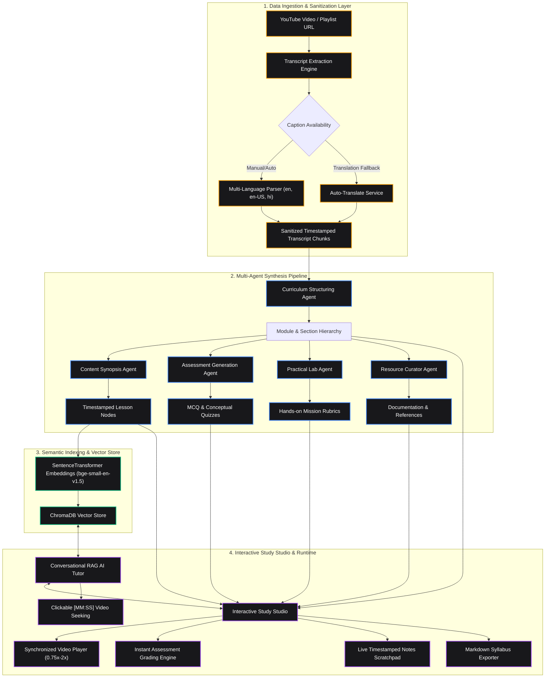

<p align="center">
  
</p>

<h1 align="center">Adhyaya AI</h1>

<p align="center">
  <strong>Agentic AI Learning Operating System</strong><br/>
  <em>Automated Transformation of Unstructured Video Feeds into Interactive Multi-Agent Curricula with Context-Grounded RAG Tutoring</em>
</p>

<p align="center">
  
  
  
  
  
  
  
  
</p>

---

## Executive Summary

Adhyaya AI transforms passive video consumption into an active, structured learning experience. By leveraging an orchestration of specialized Large Language Model agents, the platform ingests raw YouTube educational videos or playlists and synthesizes a comprehensive learning environment featuring structured modules, timeline-aligned synopses, interactive assessments, practical coding labs, and an embedded Retrieval-Augmented Generation (RAG) AI Tutor.

---

## System Architecture & Methodology



---

## Multi-Agent Orchestration Specification

The platform utilizes a decoupled multi-agent architecture built on LangChain with automated provider failover between Groq (Llama-3.3-70b-versatile) and Google Gemini (Gemini-2.5-flash):

| Agent Component | Core Functionality | Primary Output Artifact |
| :--- | :--- | :--- |
| **Curriculum Agent** | Extracts core topics, analyzes prerequisite flow, and segments content into logical learning modules. | Hierarchical Course Structure |
| **Content Structuring Agent** | Maps timeline start/end boundaries, extracts key concepts, and crafts concise section synopses. | Timestamped Lesson Segments |
| **Assessment Generation Agent** | Synthesizes MCQs, True/False, and conceptual questions with detailed explanation rationales. | Evaluated Section Quizzes |
| **Practical Lab Agent** | Designs hands-on engineering missions with objective checklists and self-evaluation rubrics. | Applied Project Rubrics |
| **Resource Agent** | Identifies external documentation, official guides, and reference resources. | Curated Reference Links |
| **AI Tutor Agent (RAG)** | Queries ChromaDB embeddings to provide context-grounded answers with precise timestamp citations. | Timestamp-Linked Explanations |

---

## Core Technical Features

### 1. Interactive Study Studio Workspace
- **Synchronized Video Player**: HTML5/YouTube wrapper supporting variable playback rates (0.75x, 1x, 1.25x, 1.5x, 2x), 10-second skips, and transcript tracking.
- **Automated Assessment Engine**: Instant client-side validation, score persistence, answer review breakdown, and retry workflows.
- **Applied Project Labs**: Structured milestone tracking with difficulty grading and comprehensive rubrics.
- **Timestamped Live Scratchpad**: In-app notes system with single-click current video time stamping and Markdown export.

### 2. Context-Grounded RAG AI Tutor
- Multi-turn conversational AI grounded in course-specific video transcripts.
- Generates clickable `[MM:SS]` timestamp citations that seek the video player to relevant points.
- Single-click integration to insert tutor explanations directly into student study notes.

### 3. Dynamic Theme Engine
- 5 curated color palettes: Amber Gold, Emerald Matrix, Cyber Indigo, Amethyst Violet, and Rose Quartz.
- Instant Dark and Light mode toggle with zero-flicker synchronous local storage state persistence.

### 4. Rapid Preset Demonstrations
- Integrated 1-click starter presets (React in 100s, Python Crash Course, Neural Networks 101, Git in 100s) for immediate testing.

---

## Engineering & Reliability Design

- **Isolated Background Task Sessions**: Background course generation tasks instantiate dedicated `SessionLocal()` lifecycles, preventing request-scoped session crashes during asynchronous execution.
- **Multi-Provider Fallback & Concurrency Semaphore**: Implements thread semaphores with exponential backoff on HTTP 429 rate limits, automatically failing over from Groq to Gemini Flash.
- **Self-Healing JSON Recovery**: Resilient regex parser that extracts raw JSON blocks, repairs unescaped quotes, and strips trailing commas before schema ingestion.
- **Transcript Extraction Resilience**: Language priority fallbacks (`en`, `en-US`, `en-GB`, `hi`) with auto-generated caption parsing and translation fallbacks.

---

## Technology Stack

```text
Frontend:     React 19, Vite, Tailwind CSS, Lucide React, Lenis Scroll, Axios
Backend:      FastAPI, Python 3.11+, SQLAlchemy 2.0, SQLite, PostgreSQL (Cloud)
AI & Vector:  LangChain, Groq (Llama 3.3 70B), Google Gemini, ChromaDB, SentenceTransformers
Security:     JWT HTTP-only Cookies, Passlib (Bcrypt), Google OAuth 2.0
Deployment:   Docker, Gunicorn, Uvicorn, Render Blueprint (render.yaml), Procfile
```

---

## Project Structure

```text
Adhyaya-AI/
├── backend/
│   ├── app/
│   │   ├── ai/
│   │   │   ├── agents/          # Multi-agent implementations (curriculum, quiz, chat, etc.)
│   │   │   └── services/        # LLM orchestration, embedding, and YouTube services
│   │   ├── core/                # Database engine, security, and JWT configuration
│   │   ├── models/              # SQLAlchemy database models (Course, Module, Section, User)
│   │   ├── routes/              # FastAPI routers (auth, course, notes, quizzes)
│   │   ├── schemas/             # Pydantic validation schemas
│   │   └── main.py              # Application entrypoint, CORS, and health checks
│   ├── Dockerfile               # Production container definition
│   ├── render.yaml              # 1-Click Render Cloud deployment blueprint
│   ├── Procfile                 # Cloud PaaS process configuration
│   ├── run.py                   # Production server launcher
│   └── requirements.txt         # Pinned Python dependencies
├── frontend/
│   ├── src/
│   │   ├── components/
│   │   │   ├── Courses/         # Study Studio, Custom Player, Chat Panel, Course Cards
│   │   │   ├── Dashboard/       # Navigation header, quick theme picker, avatars
│   │   │   └── Hero/            # Smooth landing page, agent showcase, feature grid
│   │   ├── context/             # AuthContext and dynamic theme DOM manager
│   │   ├── pages/               # Dashboard, Catalog, Settings, Profile, Auth views
│   │   └── index.css            # CSS theme variables and global light/dark cascades
│   └── package.json
└── README.md
```

---

## REST API Reference

| Method | Endpoint | Description | Auth |
| :--- | :--- | :--- | :---: |
| `POST` | `/auth/register` | Register new user account with hashed password | No |
| `POST` | `/auth/login` | Authenticate user and issue JWT cookie | No |
| `POST` | `/auth/google` | Google OAuth 2.0 token exchange | No |
| `GET` | `/auth/me` | Fetch authenticated user profile and preferences | Yes |
| `PATCH` | `/auth/me/settings` | Update theme palette, dark/light mode, and font scaling | Yes |
| `GET` | `/courses` | Retrieve user's enrolled course catalog | Yes |
| `POST` | `/courses` | Initialize AI course generation from YouTube URL | Yes |
| `GET` | `/courses/{id}` | Fetch full course curriculum, modules, and sections | Yes |
| `DELETE` | `/courses/{id}` | Remove course and associated vector embeddings | Yes |
| `POST` | `/courses/{id}/chat` | Query RAG AI Tutor for lecture-grounded answers | Yes |
| `GET` | `/courses/{id}/notes` | Retrieve course study notes and bookmarks | Yes |
| `PUT` | `/courses/{id}/notes` | Save user study notes and timestamped scratchpad | Yes |
| `GET` | `/courses/{id}/export` | Export course syllabus and notes as formatted Markdown | Yes |
| `POST` | `/courses/sections/{id}/quiz-submit` | Grade quiz submission and persist mastery score | Yes |
| `PATCH` | `/courses/sections/{id}/toggle` | Toggle lesson completion status | Yes |
| `GET` | `/health` | Liveness and database connection health probe | No |

---

## Installation & Local Setup

### 1. Prerequisites
- Node.js v18.0.0+
- Python v3.11.0+
- Git

### 2. Environment Setup

#### Backend Configuration (`backend/.env`)
```env
DATABASE_URL=sqlite:///./app.db
SECRET_KEY=your_super_secret_jwt_key
ALGORITHM=HS256
GROQ_API_KEY=your_groq_api_key
GOOGLE_API_KEY=your_gemini_api_key
YOUTUBE_API_KEY=your_google_youtube_v3_api_key
GOOGLE_URL=https://www.googleapis.com/oauth2/v3/userinfo
ALLOWED_ORIGINS=http://localhost:5173,http://localhost:3000
```

#### Frontend Configuration (`frontend/.env`)
```env
VITE_API_URL=http://localhost:8000
VITE_YOUTUBE_API_KEY=your_google_youtube_v3_api_key
```

### 3. Run Development Servers

```bash
# Setup backend
cd backend
python -m venv venv
# Windows: .\venv\Scripts\activate | macOS/Linux: source venv/bin/activate
pip install -r requirements.txt
python run.py

# Setup frontend (in a separate terminal)
cd ../frontend
npm install
npm run dev
```

- **Frontend Application**: `http://localhost:5173`
- **Backend Swagger API Docs**: `http://localhost:8000/docs`
- **Health Probe**: `http://localhost:8000/health`

---

## Cloud Deployment

### Container Deployment with Docker
```bash
cd backend
docker build -t adhyaya-ai-backend .
docker run -p 8000:8000 --env-file .env adhyaya-ai-backend
```

### Cloud PaaS (Render / Railway / Fly.io)
1. **Render**: Use the provided [`render.yaml`](file:///e:/OLD%20Files/Adhyaya%20AI/backend/render.yaml) blueprint for 1-click web service and PostgreSQL database provisioning.
2. **Railway / Fly.io**: Automatically detects the included `Dockerfile` and `Procfile`. Add the environment variables in your cloud project dashboard.

---

## License
Distributed under the MIT License.
