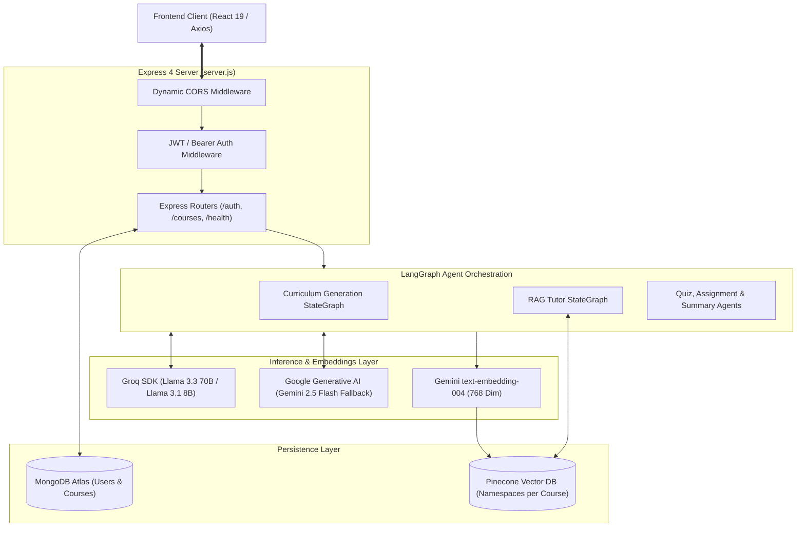

# Adhyaya AI - Backend Service

High-performance Express.js REST API and LangGraph Multi-Agent Orchestration backend powering Adhyaya AI. Converts long-form YouTube videos (10+ hours) and playlists into structured interactive courses, provides Pinecone vector embeddings for context-grounded RAG tutoring, and manages automated quiz evaluations and certificates.

---

## Table of Contents

- [Architecture Overview](#architecture-overview)
- [Key Features](#key-features)
- [Directory Structure](#directory-structure)
- [Multi-Agent StateGraph Architecture](#multi-agent-stategraph-architecture)
  - [1. Curriculum Generation StateGraph (`curriculumGraph.js`)](#1-curriculum-generation-stategraph)
  - [2. Context-Grounded RAG Tutor StateGraph (`ragGraph.js`)](#2-context-grounded-rag-tutor-stategraph)
  - [3. Assessment & Synthesis Agents](#3-assessment--synthesis-agents)
- [Pinecone Vector Search & Embeddings (`embeddingService.js`)](#pinecone-vector-search--embeddings)
- [LLM Engine & Failover Strategy (`llmService.js`)](#llm-engine--failover-strategy)
- [API Reference](#api-reference)
  - [System & Health](#system--health)
  - [Authentication & User](#authentication--user)
  - [Courses & Learning Studio](#courses--learning-studio)
- [Data Models](#data-models)
  - [User Model (`User.js`)](#user-model)
  - [Course Model (`Course.js`)](#course-model)
- [Environment Variables](#environment-variables)
- [Setup & Local Development](#setup--local-development)
- [Deployment (Vercel / Serverless)](#deployment-vercel--serverless)
- [Troubleshooting](#troubleshooting)

---

## Architecture Overview



---

## Key Features

- **LangGraph StateGraph Pipelines**: Orchestrates multi-step course synthesis with deterministic state checkpoints and isolated agent nodes.
- **10+ Hour Video Map-Reduce**: Uses adaptive timeline windowing (60s to 180s) to parse massive masterclasses without exceeding LLM context windows.
- **Pinecone Vector Database**: Indexes course transcript chunks into dedicated per-course namespaces with 768-dimensional embeddings for sub-second RAG retrieval.
- **Dual Authentication**: Full support for both local email/password (bcrypt hashing) and Google OAuth 2.0 token exchange with JWT HTTP-only cookies and Bearer token headers.
- **Robust LLM Failover**: Primary Groq inference with automated failover to Google Gemini 2.5 Flash, exponential backoff for `429 Too Many Requests`, and concurrency gating with `p-limit`.
- **Automatic Assessment Evaluation**: Instant server-side quiz grading, score tracking, answer explanation delivery, and completion state persistence.
- **Cryptographic Certificates**: Issues verifiable SHA-256 completion certificate hashes upon 100% course milestone completion.

---

## Directory Structure

```text
backend/
├── package.json                   # Dependencies and npm scripts
├── server.js                      # Express App entry point & middleware pipeline
├── vercel.json                    # Vercel Serverless Function configuration
├── Procfile                       # Production process runner config
├── .env.example                   # Environment configuration template
└── src/
    ├── config/
    │   ├── db.js                  # MongoDB Atlas connection & ready-state watcher
    │   └── env.js                 # Environment variable validation & CORS origins
    ├── middleware/
    │   ├── auth.js                # JWT verification (Cookie & Bearer header)
    │   └── errorHandler.js        # Global error normalization & friendly messaging
    ├── models/
    │   ├── User.js                # User profile & credentials schema
    │   └── Course.js              # Course, Module, and Section schemas
    ├── prompts/
    │   ├── curriculumPrompts.js   # Master prompt templates for course structuring
    │   └── ragPrompts.js          # RAG context formatting & timestamp prompts
    ├── agents/
    │   ├── curriculumGraph.js     # Master LangGraph course generation StateGraph
    │   ├── curriculumAgent.js     # Entry invoker for curriculum pipeline
    │   ├── ragGraph.js            # LangGraph conversational RAG StateGraph
    │   ├── chatAgent.js           # RAG chat execution agent
    │   ├── quizAgent.js           # Module quiz synthesis agent
    │   ├── assignmentAgent.js     # Module lab/assignment synthesis agent
    │   └── summaryAgent.js        # Module summary & takeaway synthesis agent
    ├── services/
    │   ├── llmService.js          # Groq & Gemini client with concurrency control
    │   ├── langchainService.js    # LangChain Chat Model wrapper
    │   ├── embeddingService.js    # Pinecone Vector DB integration & Gemini embeddings
    │   ├── youtubeService.js      # Multi-strategy YouTube transcript & playlist parser
    │   └── markdownService.js     # Course syllabus Markdown exporter
    ├── controllers/
    │   ├── authController.js      # Auth, profile, preferences, and Google login
    │   └── courseController.js    # Course generation, CRUD, quizzes, and RAG chat
    └── routes/
        ├── authRoutes.js          # /auth route bindings
        ├── courseRoutes.js        # /courses route bindings
        └── healthRoutes.js        # / and /health status & telemetry endpoints
```

---

## Multi-Agent StateGraph Architecture

### 1. Curriculum Generation StateGraph (`curriculumGraph.js`)

State transitions through 4 deterministic nodes:

1. `fetchTranscriptNode`: Extracts transcript timestamps via scrapers or timedtext XML, then downsamples checkpoints based on video duration.
2. `synthesizeOutlineNode`: Determines optimal module count (3 to 12 modules) and establishes timestamp boundaries.
3. `generateModuleSectionsNode`: Slices transcript windows and invokes parallel sub-agents (`quizAgent`, `assignmentAgent`, `summaryAgent`) for each module.
4. `finalizeCourseNode`: Synthesizes final title/description metadata, updates MongoDB status to `completed`, and initiates Pinecone vector indexing.

### 2. Context-Grounded RAG Tutor StateGraph (`ragGraph.js`)

1. `retrieveChunksNode`: Embeds user query (768 dimensions) and executes a cosine vector search against Pinecone scoped to `namespace(courseId)`.
2. `generateAnswerNode`: Injects top 8 context chunks + 6 recent conversation history turns into the LLM prompt, enforcing clickable `[MM:SS]` timestamp citations.

### 3. Assessment & Synthesis Agents

- `quizAgent.js`: Generates 3-5 multiple-choice questions per module with options, correct index, and educational explanations.
- `assignmentAgent.js`: Generates practical coding and architectural challenges with objective criteria.
- `summaryAgent.js`: Summarizes core module concepts and synthesizes key bullet points.

---

## Pinecone Vector Search & Embeddings

Managed in `src/services/embeddingService.js`:

- **Index Configuration**: `PINECONE_INDEX=adhyaya-ai`, Dimension `768`, Metric `cosine`.
- **Primary Embedding Model**: Gemini `text-embedding-004` (fallback to `embedding-001` or 768-dim TF-IDF hash vectorizer).
- **Course Isolation**: Each course creates a dedicated namespace `courseId`.
- **Vector Operations**:
  - `embedCourse(courseId, courseTitle, modules)`: Batches upserts to Pinecone.
  - `retrieve(courseId, question, topK, scoreThreshold)`: Queries matching chunks.
  - `deleteCourseEmbeddings(courseId)`: Deletes vectors for a course namespace.

---

## LLM Engine & Failover Strategy

Located in `src/services/llmService.js`:

- **Concurrency Gating**: Uses `p-limit` (max 3 concurrent requests) to respect provider tier limits.
- **Primary Inference Engine**: Groq SDK (`llama-3.3-70b-versatile`, `llama-3.1-8b-instant`, `openai/gpt-oss-120b`).
- **Dynamic Rate-Limit Handling**: Detects HTTP 429 and parses `Retry-After` or `try again in Xs` to apply exponential backoff.
- **Failover Engine**: Automatically switches to Google Gemini (`gemini-2.5-flash`, `gemini-1.5-flash`) on provider downtime or rate exhaustion.
- **Resilient JSON Parser**: Cleans markdown code blocks (` ```json `) and repairs malformed quotes before JSON parsing.

---

## API Reference

### System & Health

| Method | Route | Description |
| :--- | :--- | :--- |
| `GET` | `/` | Service metadata, status, version, and feature capabilities |
| `GET` | `/health` | Live probe checking MongoDB connectivity and server uptime |
| `GET` | `/health/stats` | System statistics (total users, courses, completed modules) |

### Authentication & User

| Method | Route | Auth | Description |
| :--- | :--- | :--- | :--- |
| `POST` | `/auth/register` | No | Register new account (`name`, `email`, `password`) |
| `POST` | `/auth/login` | No | Authenticate user; sets JWT cookie and returns token |
| `POST` | `/auth/google` | No | Exchange Google ID token for authenticated session |
| `GET` | `/auth/me` | Yes | Get authenticated user profile and settings |
| `POST` | `/auth/logout` | No | Clear session and cookies |
| `PUT` | `/auth/me` | Yes | Update profile name and details |
| `PATCH` | `/auth/me/settings`| Yes | Update theme, dark mode, font size, or layout preferences |

### Courses & Learning Studio

| Method | Route | Auth | Description |
| :--- | :--- | :--- | :--- |
| `POST` | `/courses` | Yes | Submit YouTube video or playlist URL for course generation |
| `POST` | `/courses/:id/retry` | Yes | Re-run generation pipeline for a failed course |
| `GET` | `/courses` | Yes | List all courses belonging to the user |
| `GET` | `/courses/:id` | Yes | Get full course details, modules, sections, and progress |
| `PATCH` | `/courses/:id` | Yes | Update course title or description |
| `DELETE` | `/courses/:id` | Yes | Delete course from MongoDB and purge Pinecone vector namespace |
| `GET` | `/courses/:id/export` | Yes | Download comprehensive Markdown syllabus and study notes |
| `GET` | `/courses/:id/certificate` | Yes | Validate 100% completion and generate SHA-256 certificate |
| `POST` | `/courses/:id/chat` | Yes | Query the RAG AI Tutor for the course |
| `PATCH` | `/courses/sections/:sectionId/toggle` | Yes | Mark section completed/incomplete |
| `POST` | `/courses/sections/:sectionId/quiz-submit` | Yes | Submit quiz answers for scoring and explanation feedback |

---

## Data Models

### User Model
- `name`: Full name
- `email`: Unique lowercase email (indexed)
- `password`: Bcrypt hashed password (nullable for Google OAuth)
- `provider`: `"local"` | `"google"`
- `settings`: Dark mode, theme color, font size, layout preferences

### Course Model
- `title`, `description`, `imageUrl`, `videoUrl`, `isPlaylist`
- `status`: `"generating"` | `"completed"` | `"failed"`
- `progress`: 0 to 100 integer
- `progressStep`: Status message string
- `userId`: Reference to User model
- `modules`: Nested array of Module subdocuments containing `sections` (video, quiz, assignment, summary)

---

## Environment Variables

Create a `backend/.env` file:

```env
PORT=8000
NODE_ENV=development
CLIENT_URL=http://localhost:5173
ALLOWED_ORIGINS=http://localhost:5173,http://localhost:3000

# Database
MONGODB_URI=mongodb+srv://<username>:<password>@cluster0.xxxxx.mongodb.net/adhyaya_ai?retryWrites=true&w=majority

# JWT Security
SECRET_KEY=your_super_secret_jwt_key_here
ALGORITHM=HS256

# AI Providers
GROQ_API_KEY=gsk_your_groq_api_key
GOOGLE_API_KEY=your_gemini_api_key
GOOGLE_CLIENT_ID=your_google_oauth_client_id.apps.googleusercontent.com
YOUTUBE_API_KEY=your_youtube_data_api_key

# Pinecone Vector Database (768 dimensions, cosine metric)
PINECONE_API_KEY=your_pinecone_api_key
PINECONE_INDEX=adhyaya-ai
```

---

## Setup & Local Development

1. Install dependencies:
   ```bash
   cd backend
   npm install
   ```
2. Configure `.env`:
   ```bash
   cp .env.example .env
   ```
3. Start development server with auto-reloading:
   ```bash
   npm run dev
   ```
4. Verify backend health:
   ```bash
   curl http://localhost:8000/health
   ```

---

## Deployment (Vercel / Serverless)

The backend includes a pre-configured `backend/vercel.json`:

```json
{
  "version": 2,
  "builds": [
    {
      "src": "server.js",
      "use": "@vercel/node"
    }
  ],
  "routes": [
    {
      "source": "/(.*)",
      "destination": "server.js"
    }
  ]
}
```

When deploying on Vercel:
- Set `CLIENT_URL` to your production frontend URL.
- Configure all environment variables (`MONGODB_URI`, `SECRET_KEY`, `GROQ_API_KEY`, `GOOGLE_API_KEY`, `PINECONE_API_KEY`, etc.).

---

## Troubleshooting

- **Server Not Starting / Port Conflict**: If port `8000` is already in use, set `PORT=8001` in `.env` (and update frontend `VITE_API_URL` accordingly).
- **Database Connection Timed Out**: Ensure your IP address is whitelisted in MongoDB Atlas Network Access (`0.0.0.0/0` for serverless).
- **Pinecone Vector Search Empty**: Verify `PINECONE_API_KEY` is provided and the index `adhyaya-ai` exists with 768 dimensions and `cosine` metric.
